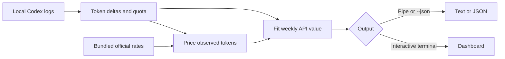

<div align="center">

# weeklygrant

**See the API-equivalent dollar value of your weekly Codex grant — from the logs already on your machine.**

[](https://www.npmjs.com/package/weeklygrant)
[](https://www.npmjs.com/package/weeklygrant)
[](https://www.typescriptlang.org/)
[](https://nodejs.org/)
[](https://github.com/aneeshpatne/weeklygrant/actions/workflows/ci.yml)
[](LICENSE)

</div>

## Run it

Published on [npm](https://www.npmjs.com/package/weeklygrant). No install or configuration required:

```bash
npx weeklygrant
```

Want the model-by-model breakdown instead?

```bash
npx weeklygrant usage
```

Other useful commands:

```bash
npx weeklygrant --json                  # complete machine-readable report
npx weeklygrant --days 30               # scan files modified in the last 30 days
npx weeklygrant --all                   # scan all history for an estimate
npx weeklygrant --refresh-prices        # look up unknown model prices
npx weeklygrant --home /path/to/.codex  # scan a different Codex home
npx weeklygrant --json --redact         # hide your local Codex home path
npx weeklygrant version                 # print the installed version
```

Requires Node.js 22 or newer and local Codex session logs. By default, weeklygrant
looks in `CODEX_HOME` and then `~/.codex`. Estimates scan the latest 30 days;
`usage` and `--json` retain all-history behavior.

## What you get

In a terminal, `npx weeklygrant` opens an interactive dashboard showing:

- estimated weekly API value;
- confidence in the estimate;
- weekly quota used and time until reset;
- grant, quota, and observed-cost graphs.

Use `←`/`→` to switch graphs, `↑`/`↓` to change the time range, and `q` or
Escape to quit.

`npx weeklygrant usage` opens a per-model usage dashboard. Use `↑`/`↓` to select
a model, `←`/`→` to change the metric, and `-`/`+` to change the time range.

When output is piped or redirected, weeklygrant automatically prints compact
text instead of the interactive UI. Pass `--json` for the full report.

## What the number means

weeklygrant reads token counters and weekly quota observations from your local
Codex JSONL session files. It prices the observed token deltas at public API
rates, compares that cost with changes in your reported weekly quota, and fits
an estimated full-week value.

The result is a **planning estimate**, not a Codex bill, credit balance, or
subscription term. It can be less reliable when:

- only a small amount of quota has moved;
- logs are missing or spread across other machines;
- a model has no known public price;
- prices or rounded quota observations change.

Low- and no-confidence estimates are withheld in the interactive UI until there
is enough reliable quota movement. If there is already enough history to graph,
the dashboard still renders quota and cost series and shows the estimate as a
dash. Press `r` to rescan.

> [!WARNING]
> weeklygrant is independent and unofficial. It is not affiliated with,
> endorsed by, or associated with OpenAI, Codex, or models.dev. Do not use its
> estimate as the sole reason for a purchase or cancellation decision.

## Privacy and networking

Session contents stay on your machine. weeklygrant has no telemetry, analytics,
accounts, advertising, or local usage database, and it writes nothing to your
session directory.

The default path uses bundled official pricing and makes no network request.
`--refresh-prices` optionally makes one GET request to `https://models.dev/api.json`
to fill prices for unknown models; it never replaces bundled official cards and
times out after two seconds. See [PRIVACY.md](PRIVACY.md) for details.

`--json` includes the resolved Codex home path. Use `--redact` before sharing
the output. Codex session files may contain prompts even though weeklygrant only
reads accounting fields; handle the original files carefully.

## How it works



The scanner recursively reads `sessions/` and `archived_sessions/` under the
resolved Codex home. `--days` filters files by modification time. Invalid JSONL
lines are skipped, and unknown models remain unpriced rather than being assigned
a guessed rate.

Token counters are cumulative, so weeklygrant normally prices their positive
difference; if a session counter resets, it recovers that request from the
request-level usage fields without counting repeated totals twice. Quota history
is split at weekly resets and plan changes while small downward jitter is ignored.
The estimator rejects divergent slices with a weighted median/MAD filter, then
derives the headline from pooled API cost divided by matched quota across the
remaining slices. Confidence is based on independent slice agreement, matched
coverage, and pair count. The grant graph uses real time and breaks at resets.

The interactive estimate runs in a worker thread so the dashboard remains
responsive while files are scanned. The full JSON report also includes pricing
sources, rate-card mode, scanned-file and event counts, measurement pairs,
dashboard series, per-model usage series, and the resolved Codex home. The
estimate TUI skips the per-model usage series to keep the worker payload small.

## Develop locally

```bash
git clone https://github.com/aneeshpatne/weeklygrant.git
cd weeklygrant
npm ci
npm run dev
```

Run the checks before submitting a change:

```bash
npm test
npm run check
npm run build
npm pack --dry-run
```

The project uses TypeScript and Node.js 22+ with no runtime dependencies. The
estimator lives in `src/lib/codex-grant.ts`; the CLI and the zero-dep TUI live in
`src/bin/` (`term.ts` plus `tui.ts`). Tests use Node's built-in test runner
through tsx. Contribution and synthetic-fixture guidelines are in
[CONTRIBUTING.md](CONTRIBUTING.md).

## License

[MIT](LICENSE). Release history is in [CHANGELOG.md](CHANGELOG.md), and security
issues can be reported using [SECURITY.md](SECURITY.md).

---

<div align="center">
  Local JSONL, public prices, a weekly API-equivalent number — and nothing uploaded.
</div>
