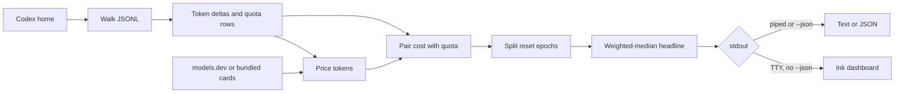
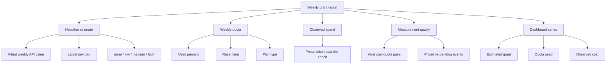
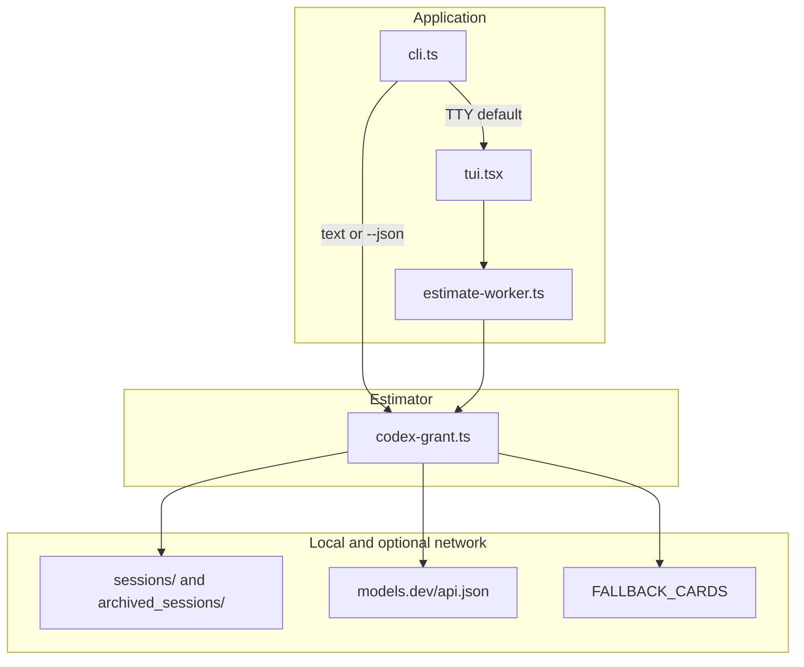

<div align="center">

# weeklygrant

**See the API-equivalent dollar value of your weekly Codex grant — from the logs already on your machine.**

A local CLI that prices Codex session token deltas at public API rates and pairs them with weekly quota changes to produce a planning estimate. It is not a Codex bill or credit balance.

[](https://www.typescriptlang.org/)
[](https://nodejs.org/)
[](https://github.com/vadimdemedes/ink)
[](https://github.com/aneeshpatne/weeklygrant/actions/workflows/ci.yml)
[](LICENSE)

</div>

---

## Overview

weeklygrant reads Codex JSONL session files from `CODEX_HOME`, `~/.codex`, or a path you pass with `--home`. It extracts token-count deltas and weekly rate-limit observations, prices those tokens at public API-equivalent rates, and fits a weekly dollar value from how observed cost moves with reported quota percentage. The result is a local planning number — useful when you want to know what this week's grant is worth in API terms without sending session contents anywhere.

On an interactive terminal the default command opens an [Ink](https://github.com/vadimdemedes/ink) dashboard: an animated worker-thread loader, then grant / quota / observed-cost Braille graphs with keyboard-controlled ranges. Piped output stays one headline and a few status lines; `--json` is the full machine-readable report. Pricing defaults to a GET of `https://models.dev/api.json` with a four-second timeout and bundled fallback cards; `--no-network` skips the request entirely.

## Features

| Area | What the project provides |
| --- | --- |
| **Local scan** | Recursively reads `sessions/` and `archived_sessions/` under the resolved Codex home. `--days` keeps only files whose modification time falls inside the window. Missing homes produce a clear "no sessions found" line, not a crash. |
| **Token accounting** | Parses `token_count` events as cumulative counters and prices the per-event delta: uncached input, cached input, and billed output. Model, service tier, and session id come from earlier `session_meta` / `turn_context` lines in the same file. |
| **Public rate cards** | Bundled cards cover the GPT-5 family used by Codex, including long-context tiers and a fast/priority multiplier. A live [models.dev](https://models.dev) payload, when it succeeds, overlays those cards. Unknown models stay unpriced (`pendingEvents`). |
| **Weekly grant fit** | Pairs priced cost with weekly `used_percent` (windows near 10,080 minutes). Valid pairs require a cost increase and at least 0.5 quota points; the headline is a weighted median of recent pairs, not a single snapshot. |
| **Reset handling** | Quota series are split into epochs on a hard drop or a reset-timestamp jump. Small downward jitter is clamped so noise does not start a new week or collapse the estimate. |
| **Confidence** | Labels the fit `none`, `low`, `medium`, or `high` from valid-pair count, quota coverage, and how tightly recent fitted values cluster. The UI wording switches from "Early" to "Stable Weekly API Value" at medium. |
| **Ink dashboard** | Full-weekly-grant, confidence, quota used, and reset-countdown tiles. Left/right cycle grant, quota, and observed-cost graphs; up/down cycle 24h / 7d / 30d / all. Charts resize to the terminal. `q` or Escape quits. |
| **Scriptable output** | Non-TTY stdout prints the headline USD plus confidence, quota, observed spend, and pair counts. `--json` emits the complete report. `--redact` replaces the resolved home path with `[redacted]`. |
| **Privacy posture** | Session contents are not uploaded. There is no telemetry, analytics, advertising, accounts, or local usage database. See [PRIVACY.md](PRIVACY.md). |

> [!NOTE]
> Version 1.0.1 ships the estimator, Ink dashboard, JSON/text output, offline pricing, and path redaction. There are no placeholder screens. The headline is a local planning estimate, not an invoice or credit balance. Unknown models remain pending. Usage that never landed in this machine's Codex JSONL is invisible.

> [!WARNING]
> weeklygrant is independent and unofficial. It is not affiliated with, endorsed by, or associated with OpenAI, Codex, or models.dev. Do not treat the estimate as a bill, a subscription term, or a reason to buy or cancel anything. Price changes, rounded or delayed quota data, missing logs, and work on other clients will throw it off.

## From logs to estimate



The estimator runs in a [worker thread](https://nodejs.org/api/worker_threads.html) when the TUI is up so the spinner can animate while files are scanned. Rate-card fetch aborts after four seconds and falls back to bundled cards; a failed or empty models.dev payload does the same. Only the first comma-separated `CODEX_HOME` entry is used. `--days` filters by file mtime, not by event timestamp. Invalid JSONL lines are skipped. Pairs outside `$1`–`$25,000` are rejected or held pending so a single noisy quota tick cannot dominate the headline.

## What's in a report



`--json` also records `pricingSources`, `rateCardMode` (`offline` or `online-with-fallback`), `filesScanned`, the algorithm id `weekly-grant-estimate`, and `codexHome` unless `--redact` is set.

## Architecture



`cli.ts` is argument parsing and output choice only: `estimate` (default), `help`, `version`, plus `--json`, `--home`, `--days`, `--no-network`, and `--redact`. All scanning, pricing, epoch splits, and the fit live in `codex-grant.ts`. `loadRateCards` accepts an injected `fetch` (or `null` for offline) so tests do not hit the network. The TUI never calls the filesystem itself; it posts `EstimateOptions` to the worker and renders the returned report. Errors from the worker surface as a single red line; CLI errors print `weeklygrant: …` and set a non-zero exit code.

## Tech stack

| Layer | Technology |
| --- | --- |
| Language | [TypeScript](https://www.typescriptlang.org/) (ESM, `NodeNext`, target ES2023) |
| Runtime | [Node.js](https://nodejs.org/) 22 or newer |
| UI | [Ink](https://github.com/vadimdemedes/ink) 7 with [React](https://react.dev/) 19 |
| Concurrency | `node:worker_threads` for the TUI estimate |
| Networking | `fetch` to `https://models.dev/api.json` (optional, 4s abort) |
| Persistence | None — reads existing Codex JSONL, writes nothing |
| Testing | Node.js built-in test runner via [tsx](https://tsx.is/) |
| Build | `tsc -p tsconfig.build.json` → `dist/` |
| CI | GitHub Actions: test, typecheck, build, `npm audit --audit-level=high`, `npm pack --dry-run` |

## Project structure

```text
weeklygrant/
├── src/
│   ├── bin/
│   │   ├── cli.ts              # Flags, TTY vs text/JSON, version/help
│   │   ├── tui.tsx             # Ink dashboard and Braille charts
│   │   └── estimate-worker.ts  # Runs estimateCodexGrant off the UI thread
│   └── lib/
│       └── codex-grant.ts      # Walk, parse, price, epochs, fit
├── test/
│   └── codex-grant.test.ts     # Pricing, resets, pairing, offline cards
├── dist/                       # Published ESM bin (weeklygrant → dist/bin/cli.js)
├── .github/workflows/ci.yml    # Node 22 CI
├── PRIVACY.md                  # Data handling and the models.dev request
├── SECURITY.md                 # Vulnerability reporting
├── CONTRIBUTING.md             # Dev commands and fixture rules
├── CHANGELOG.md
├── LICENSE
└── package.json
```

## Requirements

- **Node.js 22 or newer** to run the published CLI (`npx weeklygrant`) or a local build.
- **A Codex home** with `.jsonl` files under `sessions/` and/or `archived_sessions/`. Default is `CODEX_HOME` (first comma-separated path) or `~/.codex`.
- **An interactive TTY** for the dashboard. Piped or redirected stdout is plain text.
- **Optional network** to `https://models.dev/api.json`. Offline mode needs none.
- **Development:** npm or [Bun](https://bun.sh/), plus the repo scripts. Do not run the tool as root.

The same estimator runs locally and in CI. There is no simulator/device split. Without session files you still get a report; headline and quota fields stay empty and the CLI says no sessions were found.

## Getting started

No install for a one-off run:

```bash
npx weeklygrant                         # estimate from ~/.codex
npx weeklygrant --json                  # full machine-readable report
npx weeklygrant --home /path/to/.codex  # scan another Codex home
npx weeklygrant --days 30               # only recently modified files
npx weeklygrant --no-network            # bundled prices only
npx weeklygrant --json --redact         # hide the local Codex home path
npx weeklygrant version
```

From a clone:

```bash
git clone https://github.com/aneeshpatne/weeklygrant.git
cd weeklygrant
npm ci
npm run dev                             # tsx src/bin/cli.ts
npm run dev -- --home /path/to/synthetic/.codex --no-network
npm start                               # build, then node dist/bin/cli.js
```

`CODEX_HOME` overrides the default home when `--home` is omitted. In the TUI: `←`/`→` change graphs, `↑`/`↓` change the time range, `q` or Escape quits.

> [!IMPORTANT]
> Unless you pass `--no-network`, weeklygrant performs a GET to `https://models.dev/api.json`. That request does not include session contents. `--json` includes the resolved Codex home path; use `--redact` before sharing output. Session files can contain prompts even though this tool only reads accounting fields — see [PRIVACY.md](PRIVACY.md) and [SECURITY.md](SECURITY.md).

## Running tests

The suite is [Node's test runner](https://nodejs.org/api/test.html) on TypeScript via tsx:

```bash
npm test
# same command:
node --import tsx --test test/*.test.ts
```

`npm test` covers token pricing (including a long-context gpt-5.2-codex case), grant inference from a one-point quota move, weighted-median outlier resistance, jitter clamping, genuine reset epochs, unmatched quota jumps, and offline rate-card loading. There are no CLI or TUI tests yet.

Before a change, also run:

```bash
npm run check          # tsc --noEmit
npm run build
npm pack --dry-run
```

CI on `main` and pull requests runs those steps plus `npm audit --audit-level=high`. Add tests for estimator changes and keep fixtures synthetic — no real prompts or session logs. Details are in [CONTRIBUTING.md](CONTRIBUTING.md).

## Roadmap

The [unreleased](CHANGELOG.md) section is currently empty. Concrete gaps in the 1.0.1 surface:

- Price models that today increment `pendingEvents` instead of contributing to the fit.
- Honor more than the first path in a comma-separated `CODEX_HOME` so multi-home machines are not silently truncated.
- Cover `cli.ts` and `tui.tsx` with automated tests; the current suite is estimator-only.
- Keep bundled `FALLBACK_CARDS` aligned as Codex model ids and public list prices change.
- Decide whether usage that never appears in this host's JSONL can be represented at all (other clients and machines are currently out of scope).

## License

[MIT](LICENSE). You may use, copy, modify, merge, publish, distribute, sublicense, and sell copies, provided the copyright notice and permission notice are included in all copies or substantial portions. The software is provided without warranty.

Release history lives in [CHANGELOG.md](CHANGELOG.md).

---

<div align="center">
  Local JSONL, public prices, a weekly API-equivalent number — and nothing uploaded.
</div>
